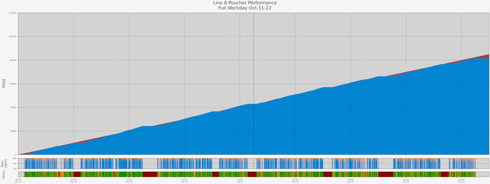
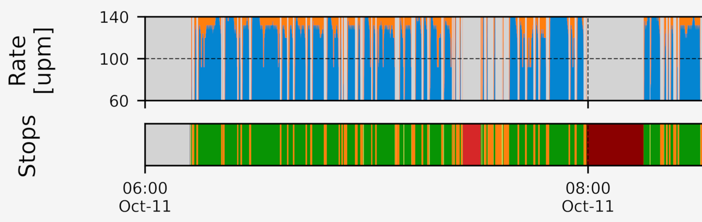

# Quidel Manufacturing Tools

## Overview

This repository contains software tools I developed in my free time to facilitate my primary role as a Manufacturing Equipment Engineer overseeing the production of Rapid Antigen tests during the Covid-19 pandemic. It consists of two main components:

**Rapids Data Analytics**

My solution to the lack of existing infrastructure to accurately track production performance and calculate KPI's such as Overall Equipment Effectiveness (OEE). A Python script takes raw CSV data from a machine vision inspection system and outputs Excel spreadsheets containing various analytics, along with a high-res PNG image of basic visualizations characterizing the production day.

**Rapids Production Dashboard**

A Flask web application which allows scheduling and tracking of work order progress, allowing better interdepartmental coordination and increasing operational efficiency. It was designed to be updated with real-time production data from Rapids Data Analytics in order to accurately predict lot changeover times, quality control inspections, managerial sign-offs, etc.

## Live Demo
* [Rapids Production Dashboard on PythonAnywhere](https://gsfran.pythonanywhere.com/)

## Visualization Examples

## Features

* Clean, simple GUI dashboard allows users to:
    * Create and schedule work orders through dependent processes
    * Track and forecast order progress automatically
    * Coordinate cross-functional resources
    * Customize the default production schedule
    * Adjust for holidays/one-off schedule changes
    * Access centralized visual management tools
* Integrated ORM compatible with any RDBMS
* Automated and purpose-built ETL microprocess
* Configurable Overall Equipment Effectiveness (OEE) analysis metrics

Possible future updates:
* E-mail alerts to stakeholders/other parties of interest
* Option to forecast using a standard rate vs. an extrapolated rate
* Operator utilization input via webform to replace use of MS Excel
* HTTP, WSGI, MySQL server set-up and implementation
* Automated real-time monitoring and predictive maintenance service
* Implement automated testing and further adoption of TDD principles
* Additional sensor types for each production line w/ comparative analysis

## Conception

**Rapids Data Analytics**

I originally began learning Python to automate the collection of production data from Excel spreadsheets stored on my company's network drive, to analyze production trends week over week. These operator-input utilization logs were not a very realiable source of data from an engineering perspective, having poor temporal resolution and a fair amount of subjectivity.

Eventually I discovered that the inspection data from our machine vision systems could be logged via FTP, so I quickly set up a server and started collecting a much more reliable source of data. I used *pandas* to build useful analytics, for the first time ever accurately characterizing the factory's performance. I also spend some time learning *matplotlib* to make a few basic visualizations -- simple charts and graphs I could analyze on-demand if needed to characterize production issues and maximize the output of important Covid-19 diagnostics tests.

**Rapids Production Dashboard**

Around this time, a major source of inefficiency for the organization was scheduling work orders, receiving and communicating progress updates, and coordinating critical actions across different functional groups. Operators and product would sometimes sit at the production line for hours because of a delay in Quality testing, for example. I had the idea to recreate the Excel-based schedule that was causing so much headache into a live dashboard that everyone could view.

Researching deployment methods, I realized a standalone program was not going to be practical; also, a centralized data source requires a centralized server. A web application satisfies all of these requirements, so I got to work learning the *Flask* web framework, *SQLAlchemy* ORM, database management and deployment, HTML templating, authorization and web security, along with so much more. 

## Key Technologies

This project is written almost entirely in Python, along with HTML/CSS for creating the web application front end.

Notable libraries include:
* *pandas* -- Data analysis/manipulation
    * Production performance analytics and reporting
    * Scheduling logic done entirely within datetime-indexed dataframes
* *matplotlib* -- data visualization
* *Flask* -- web app framework with useful extensions:
    * *Flask-SQLAlchemy* -- ORM support via SQLAlchemy
    * *Flask-WTF* -- form validation and security via WTForms
    * *Flask-Migrate* -- CLI tools for database migration via Alembic
    * *Flask-Login* --  user access control and session handling
* *Jinja2* -- endpoint templating/dynamic styling
* *python-dotenv* -- environment variable handling
* *venv* -- virtual environment handling

SQLite provided a simple and easy SQL deployment during development, for production deployment a dedicated MySQL server would be best.

This repository also includes custom python ETL tools for acquiring data:
* Plaintext csv generated by equipment sensors
* Operator reports saved in Excel format (.xlsx)

Considerable time was spent re-familiarizing myself with HTML/CSS and creating a UI/UX that was functional and pleasing. While not the main focus of this project, I still wanted the front-end to express my initial vision accurately and adhere to user experience best practices.

## Dependencies and Deployment

* HTTP Server production-grade web server (Apache, Nginx)

* WSGI Server -- interface between the web server and the python backend (mod_wsgi, Gunicorn)

* MySQL Server -- much better performance and scalability than the SQLite currently implemented

* SSO Integration -- inbuilt login functionality is minimal and not intended for production use

run `pip install -r requirements.txt` to install python dependencies

`.env` file -- see `.env.example` for required keys and value datatypes

## Lessons Learned

There's always more abstraction to consider. The importance of designing systems ahead of building them is shown by the numerous refactorizations this project has undergone.

If I were to do this over, I would start with a frontend framework such as React.js and develop that from the ground up. The additional capabilities provided by Javascript would allow greater use of the modern visual style I've strived to implement:
* Dragging and dropping a work order to load, park, etc.
* Tabbed pages for process groups
* Scalable dashboard views, e.g. 1-hour to 1-year

## Helpful Links

* [Miguel Grinberg's *The Flask Mega-Tutorial.*](https://blog.miguelgrinberg.com/post/the-flask-mega-tutorial-part-i-hello-world)

## License
Copyright (C) 2023 Garrett Francis

This program is free software: you can redistribute it and/or modify it under the terms of the GNU General Public License as published by the Free Software Foundation, either version 3 of the License, or (at your option) any later version.

This program is distributed in the hope that it will be useful, but WITHOUT ANY WARRANTY; without even the implied warranty of MERCHANTABILITY or FITNESS FOR A PARTICULAR PURPOSE.  See the GNU General Public License for more details.

You should have received a copy of the GNU General Public License along with this program.  If not, see <https://www.gnu.org/licenses/>.
